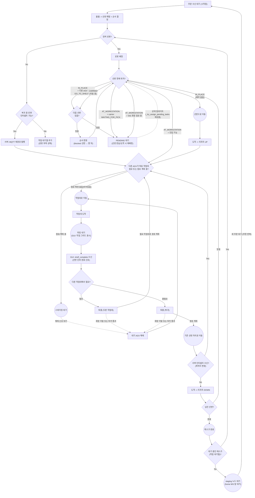

# AGV 물류 시스템 알고리즘 플로우차트



## 핵심 로직 요약

1. **주문 → 로봇 배정**: 잉여 로봇이 있을 때만 배정. 없으면 인터셉트 시도 → 불가 시 TASK_WAIT
2. **선반 위치 5분기 (F 노드)**:
   - `IN_PLACE` + 다른 AGV가 GO_TO_SHELF 중 → PENDING (선반 예약됨)
   - `IN_PLACE` + 예약 없음 → 선반 홈으로 이동 → 리프트 UP → STG
   - `CARRIED` → PENDING 대기
   - `AT_WORKSTATION` + carrier가 `WAITING_FOR_PICK` 중 → PENDING (선반 사용 중)
   - `AT_WORKSTATION` + carrier 이동/완료 → 작업대로 직행 → STG
3. **STG (스테이징 게이팅)**:
   - 목표 작업대가 비어있음 → 작업대로 이동
   - 목표 작업대가 점유 중 → 스테이징 대기
   - 퇴출 로봇이 회랑 구역 이탈(위치 기반) 또는 마커 통과 → 대기 AGV 해제 → 작업대로 이동
4. **피킹 대기**: GUI가 작업 그리드에서 물품 클릭 → 모든 물품 완료 시 `shelf_complete` 전송 → 서버가 AGV 이동 명령
5. **완료 후 분기**:
   - 다른 작업대에서 필요(포워딩) → 퇴출 → STG (마커 통과 시 대기 AGV 해제)
   - 불필요 → 퇴출 → 선반 원위치 복귀 (마커 통과 시 대기 AGV 해제)
6. **복귀 중 인터셉트**: 서버가 MQTT 재경로 발행 → 복귀 취소 → STG (새 작업대로)
7. **남은 선반 있으면** → 다음 선반으로 (F 노드부터 반복)
8. **태스크 완료 후**: TASK_WAIT에 대기 태스크 있으면 C 노드로 복귀해 재배정 / 없으면 staging 노드(home WS 앞)에서 대기

---

## 서버 알고리즘 수정 이력

### 수정 1: Node U 구현 — 복귀 중 인터셉트 (`request_handler.py`)

**플로우차트 노드 U**: "이동 중 새 주문? (같은 선반)"

**변경 전 문제**:
- `RETURNING_SHELF` 상태의 로봇은 `get_available_robot()` 결과에서 제외 → 신규 태스크(T2)가 대기만 함

**변경 내용**:

`_try_assign_pending_tasks` — `if not robot: break` 한 줄을 아래 3줄로 교체:
```python
if not robot:
    if self._try_intercept_returning_shelf(task):
        continue  # 인터셉트 성공 → 다음 대기 작업 처리 시도
    break         # 인터셉트도 불가 → 종료
```

`_try_intercept_returning_shelf(task)` 메서드 신규 추가:
- task의 첫 선반을 RETURNING_SHELF로 운반 중인 로봇을 찾음
- 해당 로봇의 현재 서브태스크가 RETURN_SHELF인지 확인
- RETURN_SHELF → FORWARD_SHELF 로 변경, target_node를 새 작업대(T2의 workstation_id)로 갱신
- 로봇 상태 → DELIVERING_TO_WS, 새 경로 MQTT 재발행

**시나리오 흐름**:
1. AGV-1: 선반11을 WS1에서 피킹 완료 후 선반11 홈으로 반납 중 (RETURNING_SHELF)
2. 신규 주문 T2 접수: 선반11 필요, WS2로 배달 요청
3. `_try_assign_pending_tasks` → `get_available_robot()` → None → `_try_intercept_returning_shelf(T2)` 호출
4. 인터셉트 성공: AGV-1의 RETURN_SHELF 서브태스크 → FORWARD_SHELF (target=WS2)
5. `continue` → T2 재처리 → `get_available_robot()` → None → 인터셉트 재시도 → False (AGV-1 이미 DELIVERING_TO_WS) → `break`
6. AGV-1이 WS2 도착 → putdown → `handle_shelf_forwarded(11, WS2)` → T2의 GO_TO_SHELF target = WS2
7. `_try_assign_pending_tasks()` → T2에 유휴 로봇 배정 → 정상 진행

---

### 수정 2: 피드백 3가지 반영

#### 피드백 1 — 인터셉트 시 이전 WS 회랑 자동 해제

**문제**:
`pick_complete` → `mark_exiting(WS1)` → WS1 corridor OCCUPIED (by AGV-1)
이후 Node U 인터셉트로 AGV-1이 WS2로 방향 전환 → AGV-1이 WS1 트리거를 통과하지 못함
→ WS1 corridor가 타임아웃(30초)까지 OCCUPIED 유지, 대기 로봇이 진입 불가

**수정 위치**: `_try_intercept_returning_shelf` 내부

**수정 내용**: 인터셉트 직후, `staging_manager.corridors`에서 인터셉트된 로봇이 점유한 회랑을 탐색해 직접 해제
- 대기 큐에 로봇이 있으면 → 해제 후 해당 로봇을 작업대로 진입
- 대기 큐가 비어있으면 → corridor 상태 FREE로 전환

#### 피드백 2 — 이동 중인 선반 상태 정확화 (AT_WORKSTATION → CARRIED)

**문제**:
- DELIVER_TO_WS 도착 시 `mark_shelf_at_workstation()` 호출 → `shelf.status = AT_WORKSTATION`
- 이후 `pick_complete`로 로봇이 선반을 들고 이동 시작해도 상태가 AT_WORKSTATION으로 유지됨
- 이동 중인 선반이 작업대에 있는 것으로 잘못 표현됨

**수정 위치**: `_handle_pick_complete` 내부, return/forward 분기 시작 직전

**수정 내용**: 로봇이 WS에서 선반을 들고 출발할 때(두 경우 모두) `mark_shelf_picked_up(shelf_id, robot.rid)` 호출
- `next_action == "return"` → RETURNING_SHELF 시작 전 호출
- `next_action == "forward"` → DELIVERING_TO_WS(FORWARD) 시작 전 호출
- 결과: 이동 중에는 `shelf.status = CARRIED`, 목적지 도착/내려놓기 후에만 AT_WORKSTATION

#### 피드백 3 — 복귀 중인 로봇의 주문 수신 메커니즘

**질문**: 이미 이동 중인 RETURNING_SHELF 로봇이 어떻게 새 경로를 받을 수 있는가?

**답변 (코드 주석으로 명시)**:
`_plan_and_publish_move()` 가 새 경로를 MQTT로 재발행 → 로봇은 자신의 MQTT topic을 구독 중이므로 새 plan 메시지를 즉시 수신 → 현재 이동을 중단하고 새 목적지로 향함

**수정 파일**: `server/request_handler.py` (`_try_assign_pending_tasks` 인터셉트 분기 추가, `_try_intercept_returning_shelf` 신규 메서드, `_handle_pick_complete` 선반 상태 갱신, `CorridorState` import 추가)

---

### 수정 3: 피드백 3가지 다이어그램 반영

#### 피드백 1 — STG 점유 판단 기준 명확화
- `F` 분기: `작업대 아님` → `작업대 아님 (이동 중 포함)` / `작업대에 있음` → `작업대에 정지 중`
- STG 노드: "점유중?" → "점유 또는 점유 계획 중?"
- STG 엣지: `비어있음` → `비어있음 (계획 포함)` / `점유 중` → `점유/계획 중`

#### 피드백 2 — 이동 중인 선반 분류 명시
- F 노드 분기 라벨에 "(이동 중 포함)" / "정지 중" 추가로 CARRIED 상태가 "작업대 아님"임을 명시

#### 피드백 3 — 서버 인터셉트 트리거 흐름 추가
- `C -- No` 경로에 `INT` 노드 추가: "복귀 중 로봇 인터셉트 가능?"
  - Yes → `SVR["서버: MQTT 재경로 발행"]` → 점선으로 U에 연결
  - No → IDLE
- `U` 노드를 결정 다이아몬드(로봇 자기 판단)에서 프로세스 노드(서버 인터셉트 수신)로 변경
- `T → U` 연결 제거, `T → V` 직행 (정상 복귀 경로)
- 서버가 주도적으로 MQTT 재경로를 발행하고 로봇이 수신하는 흐름 명시

---

### 수정 4: F 노드 "선반 현재 위치?" 체크 누락 → 수정 완료

**플로우차트 F 노드**:
- `F -- "작업대에 정지 중" --> STG` (AT_WORKSTATION → WS로 직행)
- `F -- "작업대 아님(이동 중 포함)" --> G` (IN_PLACE / CARRIED → 홈 노드로 이동)

**수정 전 문제** (`task_manager.py:158-163`):
- `create_task()` 시점에 항상 `target_node=shelf_id` (홈 노드)로 고정
- `_try_assign_pending_tasks()` 에서 shelf 현재 상태 체크 없이 이동 명령

**버그 시나리오**:
- shelf가 `AT_WORKSTATION` 상태일 때 새 task 배정 → 비어있는 홈 노드로 로봇 이동 (잘못된 동작)
- shelf가 `CARRIED` 상태 (RETURNING 아님, 예: DELIVERING_TO_WS) 일 때 새 task 배정 → 동일 문제

**수정 내용** (`server/request_handler.py`):

수정 위치 1 — `_try_assign_pending_tasks()` 내 `start_task()` 직후:
- `AT_WORKSTATION` → `first_st.target_node = shelf.current_node` (WS 노드로 변경)
- `CARRIED` → task PENDING 복귀, `assigned_robot = None`, break

수정 위치 2 — `_handle_putdown_ack()` RETURN_SHELF `next_subtask` 분기:
- 동일 체크 추가, CARRIED 시 robot IDLE + task PENDING + `_try_assign_pending_tasks()` 재호출

수정 위치 3 — `_handle_putdown_ack()` FORWARD_SHELF `next_subtask` GO_TO_SHELF 분기:
- 동일 체크 추가

**추가 변경**: `ShelfStatus`를 최상단 import로 이동 (`_get_occupied_shelf_nodes()` 내 로컬 import 제거)

---

### 수정 5: STG 타임아웃 해제 후 이동 명령 누락 버그 수정

**버그**: `staging_manager._check_timeout()` 에서 30초 타임아웃으로 staged AGV를 해제할 때
`occupying_rid`만 갱신하고 이동 명령을 주지 않아 해당 AGV가 staging 노드에서 영구 교착

**정상 해제 경로(마커 트리거)와의 차이**:
- 마커 트리거: `handle_marker_trigger()` → `StagedAGV` 반환 → `request_handler`가 `_plan_and_publish_move()` 호출 ✅
- 타임아웃: `_check_timeout()` 내부에서 처리 종료, 이동 명령 없음 ❌

**수정 방법**: pending_timeout_releases 리스트를 통한 디커플링

수정 1 — `staging_manager.py` `__init__`:
- `self.pending_timeout_releases: List[StagedAGV] = []` 추가

수정 2 — `staging_manager.py` `_check_timeout()`:
- 타임아웃으로 released된 AGV를 `pending_timeout_releases`에 적재

수정 3 — `request_handler.py` `_plan_and_publish_move()`:
- `should_stage()` 호출 직후 `pending_timeout_releases` 드레인
- 각 released AGV에 대해 `_plan_and_publish_move(rid, staging_node, target_ws)` 호출

---

### 수정 6: DELIVER_TO_WS 도착 후 PENDING 태스크 재배정 누락 버그 수정

**버그**: 선반이 CARRIED → AT_WORKSTATION 전환 시 `_try_assign_pending_tasks()` 미호출
→ CARRIED 때문에 PENDING으로 대기 중이던 다른 태스크가 재시도 안 됨

**버그 발생 시나리오**:
1. 선반 11이 CARRIED (AGV-1이 WS1으로 이동 중)
2. T2 등록: 선반 11 필요 → F-node 체크: CARRIED → T2 PENDING으로 복귀
3. AGV-1이 WS1 도착 → `mark_shelf_at_workstation()` → 선반 11 AT_WORKSTATION
4. ❌ (수정 전) `_try_assign_pending_tasks()` 미호출 → T2가 선반 반납까지 대기
5. ✅ (수정 후) `_try_assign_pending_tasks()` 호출 → T2에 AGV-2 즉시 배정 가능

**수정 위치**: `request_handler.py` `_process_arrival()` DELIVER_TO_WS 분기

수정 내용: `set_robot_status(WAITING_FOR_PICK)` 직후 `self._try_assign_pending_tasks()` 추가

---

### 수정 7: FORWARD_SHELF putdown next_subtask 후 PENDING 재배정 누락 수정

**버그**: FORWARD_SHELF putdown 후 해당 로봇에게 다음 선반이 있는 경우(next_subtask),
`mark_shelf_at_workstation()` 호출 후 `_try_assign_pending_tasks()` 미호출
→ 포워딩된 선반(AT_WORKSTATION)을 기다리던 PENDING 태스크가 즉시 재배정 안됨

**task_complete 분기**: `_try_assign_pending_tasks()` 이미 호출 중 ✅
**next_subtask 분기**: 누락 ❌ → 수정

**수정 위치**: `request_handler.py` `_handle_putdown_ack()` FORWARD_SHELF next_subtask GO_TO_SHELF 분기

수정 내용: "다음 선반으로 이동" 직전에 `self._try_assign_pending_tasks()` 추가

---

### 수정 8: F 노드 2가지 누락 케이스 추가 (동일 선반 동시 배정 버그)

**버그 재현**: `시작 1` + `시작 2`를 연달아 실행하면 T1_1, T2_1 모두 같은 선반(예: 선반11)을
`GO_TO_SHELF` 타겟으로 배정받아 두 AGV가 동시에 같은 선반으로 이동 → 충돌

**원인**: F 노드가 3분기(`IN_PLACE`/`CARRIED`/`AT_WORKSTATION`)만 처리하고 아래 2 케이스 누락:
1. `IN_PLACE`이지만 **다른 AGV가 이미 GO_TO_SHELF로 이동 중** → PENDING 처리 필요
2. `AT_WORKSTATION`이지만 **carrier 로봇이 WAITING_FOR_PICK 중** → PENDING 처리 필요
   (포워딩 전에 다른 태스크가 같은 선반의 WS 방문을 요청할 때 발생)

**수정 내용** (`server/request_handler.py`):

추가 1 — `_is_shelf_targeted_by_moving_robot(shelf_id, exclude_rid)` 신규 헬퍼:
- 다른 로봇이 MOVING_TO_SHELF 상태이고 현재 서브태스크가 `GO_TO_SHELF(shelf_id)` 이면 True

추가 2 — `_get_shelf_availability(shelf_id, exclude_rid)` 신규 헬퍼 (F노드 중복 제거):
- `'direct'` : AT_WORKSTATION + carrier NOT WAITING_FOR_PICK → WS 직행
- `'pending'` : CARRIED / AT_WORKSTATION+WAITING_FOR_PICK / IN_PLACE+reserved
- `'go'`     : IN_PLACE + 예약 없음

수정 위치 1 — `_try_assign_pending_tasks()` F노드:
- 기존 `if AT_WORKSTATION` / `elif CARRIED` 를 `_get_shelf_availability()` 로 통합

수정 위치 2 — `_handle_putdown_ack()` RETURN_SHELF next_subtask F노드:
- 동일 통합

수정 위치 3 — `_handle_putdown_ack()` FORWARD_SHELF next_subtask F노드:
- 동일 통합

**수정 파일**: `server/request_handler.py`, `FLOWCHART.md`

---

### 수정 9: Bug A (AGV 교착) + Bug B (STG 우회) 수정

#### Bug A — 첫 선반 블록 시 AGV 교착 (선반 순서 회전)

**버그 증상**: T2(선반 A, B 필요) 배정 시도 → 선반 A가 다른 AGV에 의해 CARRIED 상태 →
F-node: `pending` → T2 PENDING으로 복귀 → 재배정 시도해도 선반 A가 여전히 블록 → AGV-2 영구 교착

**원인**: F-node에서 첫 선반이 blocked일 때 전체를 PENDING으로 복귀하고 다음 선반을 시도하지 않음

**수정 내용**:

`task_manager.py` — `rotate_shelf_to_end(task_id)` 신규 메서드:
- 현재 블록된 선반의 서브태스크 5개(`GO, PICKUP, DELIVER, WAIT, RETURN`)를 남은 서브태스크 맨 뒤로 이동
- `shelf_sequence`도 동일하게 업데이트 (`completed_count` 기준으로 남은 선반 중 첫 번째를 맨 뒤로)
- 다음 시도할 선반 ID 반환; 다음 선반 없으면 None

`request_handler.py` — `_try_assign_pending_tasks()` F-node `elif avail == "pending"` 분기:
- `rotation_counts: Dict[str, int]` 로컬 딕셔너리로 순환 시도 횟수 추적
- `rotations < max_rotations(= len(shelf_sequence) - 1)` 이면 `rotate_shelf_to_end()` 호출 후 `continue`
- 모든 선반 차단 시 기존 `break` (PENDING 복귀)

**플로우차트**: `FSKIP`, `FREORDER` 노드 (6분기 중 `IN_PLACE+blocked` 및 `CARRIED` 경로)

#### Bug B — home=WS인 AGV가 STG 스테이징 우회

**버그 증상**: AGV-2(home=WS2=34) 배정 → 선반이 AT_WORKSTATION(WS2) → `_plan_and_publish_move(start=34, goal=34)` 호출 →
`start==goal` 즉시 도착 처리가 STG 체크보다 먼저 실행 → `should_stage()` 미호출 → 회랑 점유 등록 안됨 →
이후 AGV-1이 같은 WS2로 향할 때 corridor FREE로 판단 → 스테이징 없이 진입 → 충돌

**원인**: `_plan_and_publish_move`에서 `start==goal` 체크가 Point A(staging 체크)보다 앞에 위치

**수정 1** — `_plan_and_publish_move()` 순서 변경:
- 기존: `start==goal` 즉시 도착 → `should_stage()` 호출 (스킵됨)
- 수정: `should_stage()` 먼저 호출 → `actual_goal` 결정 → `start==actual_goal` 즉시 도착
- 효과: home=WS2인 로봇도 `should_stage(WS2, rid)` 호출 → 회랑 점유 정상 등록

**수정 2** — `_get_shelf_availability()` AT_WORKSTATION 분기에 회랑 점유 체크 추가:
- carrier WAITING_FOR_PICK 체크 후, WS 회랑 점유 여부 추가 확인
- 다른 로봇이 회랑 점유 중(`corridor.occupying_rid != exclude_rid`) → `'pending'` 반환

**수정 3** — `handle_marker_trigger()` 회랑 FREE 시 재배정 추가:
- 대기 AGV 없이 회랑이 FREE될 때 `_try_assign_pending_tasks()` 호출
- AT_WORKSTATION + 회랑 점유로 PENDING 됐던 작업을 트리거 통과 후 즉시 재배정

**수정 파일**: `server/request_handler.py`, `server/task_manager.py`, `FLOWCHART.md`

---

### 수정 10: FORWARD_SHELF 후 다음 선반 가로채기 버그 수정

**버그 증상**: Robot A가 FORWARD_SHELF 완료 후 다음 선반(shelf X)으로 이동 시도 시,
Robot B(PENDING 상태)가 같은 shelf X를 동시에 배정받아 두 로봇이 동시에 이동 → 선반 뺏기 발생

**원인**: `_handle_putdown_ack` → FORWARD_SHELF → next_subtask 분기에서
`_try_assign_pending_tasks()` 호출 순서가 `set_robot_status(MOVING_TO_SHELF)` 및
`_plan_and_publish_move()` 보다 **앞에** 위치

- `_try_assign_pending_tasks()` 실행 시 Robot A의 상태가 아직 DELIVERING_TO_WS
- `_is_shelf_targeted_by_moving_robot(X, B)` → Robot A가 MOVING_TO_SHELF 아님 → **False**
- shelf X가 "go" 또는 "direct"로 판정 → Robot B에게도 shelf X 배정됨
- 이후 Robot A도 MOVING_TO_SHELF로 전환 + shelf X로 이동 → 두 로봇 충돌

**수정 내용** (`server/request_handler.py`):

순서 변경:
```
(수정 전)
_try_assign_pending_tasks()  ← BUG
set_robot_status(MOVING_TO_SHELF)
_plan_and_publish_move()

(수정 후)
set_robot_status(MOVING_TO_SHELF)    ← Robot A를 먼저 예약 등록
_plan_and_publish_move()             ← "direct"면 corridor OCCUPIED 등록
_try_assign_pending_tasks()          ← 이제 B가 shelf X를 배정받지 못함
```

보호 메커니즘:
- "go"(IN_PLACE) 케이스: Robot A가 MOVING_TO_SHELF → `_is_shelf_targeted_by_moving_robot` True → "pending"
- "direct"(AT_WORKSTATION) 케이스: `_plan_and_publish_move` → `should_stage` → corridor OCCUPIED by A → "pending"

**수정 파일**: `server/request_handler.py`

---

### 수정 11: start_order 응답 shelf 순서 로테이션 미반영 버그 수정

**버그 증상**: `시작1`, `시작2` 후 `완료2` 입력 시 AGV-2가 움직이지 않음

**재현 시나리오** (DB 기준):
- User 1 (WS1): 드롭스(shelf 11), 퍼지(shelf 15), 구미(shelf 20), 무설탕 캔디(shelf 22)
- User 2 (WS2): 롤리팝(shelf 11), 마시멜로(shelf 20), 계피사탕(shelf 14)
- shelf 11, shelf 20이 두 사용자에게 공통으로 필요

**원인 분석**:

1. `시작2` 실행 → T2_1 생성 (원래 최적 순서 `[11, 20, 14]`)
2. `_try_assign_pending_tasks()` 호출:
   - first_shelf=11 → `_is_shelf_targeted_by_moving_robot(11, AGV-2)` → True (AGV-1이 11로 이동 중)
   - `_get_shelf_availability` = `"pending"` → **Bug A 로테이션** 실행
   - T2_1.shelf_sequence = `[20, 14, 11]`로 변경
   - AGV-2는 shelf 20으로 배정됨
3. **`_handle_start_order` 응답은 로테이션 전 `schedule["tasks"]`로 생성** → `shelves` = `[11, 20, 14]`
4. `websocket_test.py`의 `UserOrder.shelves` = `[11, 20, 14]` (CLI가 로테이션을 모름)
5. AGV-2는 실제로 shelf 20 먼저 처리 → WS2 도착 → WAIT_PICKING(마시멜로) 대기
6. `완료2` 입력: CLI는 current_shelf = shelf 11 (롤리팝) → `pick_complete item="롤리팝"` 전송
7. 서버: T2_1 WAIT_PICKING은 shelf 20 (마시멜로) → "롤리팝"이 `items_to_pick`에 없음
   → `remaining = ["마시멜로"]` (비어있지 않음) → `"continue_picking"` 반환
8. CLI: `success=True` 수신 → AGV-2 이동 명령 없이 `order.advance()` 호출 → **불일치**

**수정 내용** (`server/request_handler.py`, `_handle_start_order`):

`_try_assign_pending_tasks()` 호출 후, task의 실제 `shelf_sequence`(로테이션 반영)를 기준으로
`shelves` 응답을 재구성:

```python
# 수정 전: 항상 schedule["tasks"] (로테이션 전) 기준
shelves = [{"order": t.order, "shelf_label": t.shelf_label, ...} for t in schedule["tasks"]]

# 수정 후: task_obj.shelf_sequence (로테이션 후) 기준으로 재구성
task_obj = self.task_manager.get_task(task_id)
if task_obj:
    schedule_map = {t.shelf_node: t for t in schedule["tasks"]}
    wait_picking_items = {st.shelf_id: st.items_to_pick for st in task_obj.subtasks
                          if st.subtask_type == WAIT_PICKING}
    shelves = [
        {"order": idx+1, "shelf_label": ..., "shelf_node": sid, "items": ...}
        for idx, sid in enumerate(task_obj.shelf_sequence)
    ]
```

**효과**:
- CLI의 `UserOrder.shelves` 순서 = 서버의 실제 처리 순서 → `완료2` 시 올바른 shelf/item 전송
- `완료2` → pick_complete("마시멜로") → WAIT_PICKING 완료 → AGV-2 이동 명령 정상 발행

---

### 수정 12: 포워딩 시 소스 회랑 무한 스테이징 버그 수정

**문제**: 포워딩 로봇이 소스 WS 트리거 노드를 통과하지 못해 대기 AGV가 무한 스테이징

**원인**:
- RETURN_SHELF는 퇴출 경로(WS→gateway→trigger)가 고정되어 ArUco 트리거 확실히 통과
- FORWARD_SHELF는 퇴출 후 다른 WS로 직행 → 소스 WS 트리거 노드가 경로에 없을 수 있음
- 교착상태: AGV-1 WS1→WS2 포워딩 + AGV-2 WS2→WS1 포워딩 동시 시 `mark_exiting`이 서로의 회랑을 점유 → 둘 다 스테이징 → 트리거 통과 불가 → 영구 대기

**수정 내용**:

`staging_manager.py` — `release_corridor_without_trigger(ws_node, rid)` 추가:
- 포워딩 전용 소스 회랑 즉시 해제
- 대기 AGV 있으면 corridor 소유권 이전 후 반환 / 없으면 FREE

`request_handler.py` — `_handle_pick_complete` forward 분기:
- `mark_exiting` 제거 → `release_corridor_without_trigger` 호출로 교체
- 순서: 포워딩 경로 계획(`_plan_and_publish_move`) → 소스 회랑 해제 (A*가 포워딩 경로 예약 참조해 게이트웨이 충돌 방지)
- 해제된 AGV가 이미 스테이징 노드에 도착해 있으면 즉시 이동 명령 / 아직 이동 중이면 `_staged_to_ws`에 등록

`request_handler.py` — `_handle_robot_arrived` Point B-1 추가:
- `_staged_to_ws`에 등록된 로봇이 스테이징 노드에 도착하면 즉시 목표 WS로 이동 명령 발행

**안전성**:
- 포워딩 경로가 먼저 `_robot_planned_paths`에 등록되므로, 해제된 AGV의 A*가 포워딩 로봇의 게이트웨이 통과 시간을 예약으로 참조 → 게이트웨이 동시 점유 방지

---

### 수정 13: 동시 포워딩 시 횡방향 이동 중 충돌 방지

**문제**: 두 AGV가 동시에 포워딩 중 한 AGV가 횡방향으로 비키는 도중 다른 AGV가 기다리지 않아 충돌

**원인 1 — 방향 기반 감지 한계**:
- 기존 충돌 회피: `is_ahead`(전방 180° 이내) 기준, 전방이 아니면 감속 없음
- AGV-1이 동쪽으로 이동 중, AGV-2가 북쪽으로 진행 → `is_ahead=False` → 풀속도 → 충돌

**원인 2 — A* 타이밍 오차**:
- A*는 이산 타임스텝 기준 계획, 실제 실행은 회전 지연 등으로 타이밍 어긋남
- 계획 충돌 없어도 실행 시 같은 노드에 동시 도착 가능

**수정 내용**:

`base.py`: `CollisionSensorInterface`에 `get_other_robot_position() → Optional[Tuple]` 기본 메서드 추가

`webots_hw.py`: `WebotsCollisionSensor.get_other_robot_position()` 구현 (Supervisor API 활용)

`navigation.py`:
- `world_to_node(x, y)` 정적 메서드 추가 (월드 좌표 → 노드 ID, SNAP_DIST=0.45 이내)
- `get_collision_speed_factor()` 노드 기반 체크 추가:
  - 다른 로봇의 위치를 노드로 변환 → 내 `_moving_to_node`와 같으면 방향 무관 감속/정지
  - 기존 방향 기반 체크는 fallback으로 유지

`request_handler.py` `_get_other_robot_reservations()`:
- 이동 로봇 예약에 **+1 타임스텝 버퍼** 추가 (회전 지연 보정)
- 목표 도착 후 대기 예약: 3스텝 → 5스텝으로 확대

**수정 파일**: `server/request_handler.py`, `controllers/agv_mqtt_controller/navigation.py`, `hardware/webots_hw.py`, `hardware/base.py`

---

### 수정 14: F-노드 stale shelf_sequence 버그 수정

**파일**: `server/request_handler.py`, `_try_assign_pending_tasks()`

**증상** (시뮬레이션 로그에서 확인):
1. 완료 후 로봇이 작업대에 도착해도 멈추지 않음
2. 작업대에서 선반을 내려놓음 (집으로 가서 내려놔야 하는데)
3. 다른 로봇이 그 선반 픽업 시 Webots 순간이동

**원인**:

`_try_assign_pending_tasks()`에서 F-노드 체크 시 `task.shelf_sequence[0]`을 사용하는데,
`shelf_sequence`는 완료된 선반을 자동으로 제거하지 않음.
예: shelf 11이 FORWARD_SHELF로 완료된 후에도 `shelf_sequence[0] = 11`이 남아있음.
실제 현재 서브태스크는 `start_task()`가 반환한 `first_st`(GO_TO_SHELF(20))인데,
F-노드가 shelf 11(AT_WORKSTATION at WS34)을 체크 → "direct" → `first_st.target_node = 34`로 덮어씌움.
Robot이 WS34에서 즉시도착 처리 → shelf 20을 WS34에서 픽업 명령 → Webots 순간이동 발생.

**수정 내용** (`server/request_handler.py`, `_try_assign_pending_tasks`):

```python
# 수정 전: shelf_sequence[0] 사용 (완료된 선반이 남아있어 stale할 수 있음)
shelf_obj = self.shelf_manager.get_shelf(first_shelf) if first_shelf else None
if shelf_obj:
    avail = self._get_shelf_availability(first_shelf, robot.rid)

# 수정 후: first_st.shelf_id 사용 (실제 현재 서브태스크 기준)
actual_first_shelf = first_st.shelf_id if first_st else first_shelf
shelf_obj = self.shelf_manager.get_shelf(actual_first_shelf) if actual_first_shelf else None
if shelf_obj:
    avail = self._get_shelf_availability(actual_first_shelf, robot.rid)
```

**효과**:
- F-노드 체크가 실제 현재 서브태스크의 선반을 기준으로 동작
- 완료된 선반의 위치가 잘못된 target_node로 덮어씌워지는 현상 해소
- 순간이동, 작업대 putdown, WS 미정지 버그 해결

**수정 파일**: `server/request_handler.py`

---

### 수정 15: FORWARD_SHELF 후 포워딩 로봇이 목적지 WS 전체 사이클 담당

**문제**: FORWARD_SHELF putdown 후 T1이 즉시 다음 선반으로 이동해 버림
→ 선반이 목적지 WS(WS2)에 방치됨
→ T2 로봇이 나중에 같은 WS2 노드에 도착 시 선반 2개 동시 존재 → 충돌/텔레포팅

**원인**:
- `_decide_shelf_action`이 RETURN_SHELF → FORWARD_SHELF 변환만 하고 목적지 WS 처리 서브태스크를 삽입하지 않음
- `_handle_putdown_ack` FORWARD_SHELF 브랜치에서 putdown 후 바로 다음 선반(GO_TO_SHELF)으로 이동
- T2의 선반 서브태스크 취소 로직 없음 → T2 로봇도 WS2로 진입 시도 → 충돌

**수정 내용**:

`task_manager.py` — `advance_subtask()` 수정:
- 포워딩 스킵으로 미리 COMPLETED된 서브태스크를 자동으로 건너뜀

`task_manager.py` — `handle_shelf_complete()` (수정 16에서 `handle_item_picked`에서 개명):
- 이 선반의 다음 서브태스크가 PICKUP_SHELF(같은 선반)이면 `_decide_shelf_action` 대신
  `{"action": "shelf_done_pickup_for_return"}` 반환 (포워딩 재픽업 사이클 감지)

`task_manager.py` — 신규 메서드 5개 추가:
- `insert_forward_return_subtasks(task_id, shelf_id, dest_ws, items)`:
  FORWARD_SHELF 다음에 WAIT_PICKING(dest_ws, T2_items) + PICKUP_SHELF(dest_ws) + RETURN_SHELF(home) 삽입
- `skip_shelf_subtasks_for_forwarding(task_id, shelf_id)`:
  T2의 해당 선반 서브태스크 전체를 COMPLETED 표시 + current_idx 이동 → next subtask 반환
- `get_demand_items_for_ws(shelf_id, ws_id)`: 목적지 WS의 아직 미픽업 아이템 조회
- `find_task_with_item_at_ws(item, ws_node)`: 교차-태스크 라우팅용 — 해당 WS의 WAIT_PICKING 중인 태스크 탐색
- `remove_shelf_demand_for_shelf(task_id, shelf_id)`: 특정 작업의 특정 선반 수요만 제거

`request_handler.py` — `_handle_putdown_ack` FORWARD_SHELF 브랜치 재작성:
```
1. mark_shelf_at_workstation + set_carrying_shelf(None)
2. get_demand_items_for_ws(shelf_id, dest_ws) → T2 아이템 목록
3. insert_forward_return_subtasks() → T1에 WAIT+PICKUP+RETURN 삽입
4. skip_shelf_subtasks_for_forwarding(T2) → T2 선반 서브태스크 스킵
5. remove_shelf_demand_for_shelf(T2, shelf_id) → T2 수요 제거
6. _reroute_robot_after_skip() → T2 로봇 재라우팅
7. handle_subtask_complete() → T1: FORWARD_SHELF → WAIT_PICKING
8. robot → WAITING_FOR_PICK
```

`request_handler.py` — `_handle_pickup_ack()` 수정:
- `next_st.subtask_type == RETURN_SHELF` 케이스 추가:
  포워딩된 선반 재픽업 완료 → `mark_exiting` + 홈으로 이동 계획

`request_handler.py` — `_handle_shelf_complete()` (수정 16에서 `_handle_pick_complete`에서 개명):
- `shelf_done_pickup_for_return` 액션 처리: T1 로봇에 pickup 명령 발행
- (아이템 단위 교차-태스크 라우팅 제거 → `find_task_waiting_for_shelf(shelf_id)` 선반 단위 탐색으로 대체)

`request_handler.py` — `_reroute_robot_after_skip()` 신규 추가:
- T2의 선반 서브태스크 스킵 후 T2 로봇의 경로를 새 목적지(다음 선반 or 홈)로 재계획

**수정 후 포워딩 전체 플로우**:
```
T1: WS1 pick_complete → FORWARD_SHELF(WS2로 이동)
  → FORWARD_SHELF putdown at WS2
  → T2 선반 서브태스크 스킵 (T1이 대신 처리)
  → T1: WAIT_PICKING(WS2, T2_items) ← WAITING_FOR_PICK
  → pick_complete(T2 task_id) → 교차-라우팅 → T1.handle_item_picked
  → 모든 아이템 완료 → shelf_done_pickup_for_return
  → T1: pickup 명령(re-pickup) → PICKING_UP_SHELF
  → pickup ack → RETURN_SHELF to home → RETURNING_SHELF
  → putdown at home → IN_PLACE → 다음 선반 or task_complete
T2: 해당 선반 서브태스크 스킵됨 → 다른 선반 계속 or 완료
```

---

### 수정 16: UI MQTT 연동 + 아이템 단위 → 선반 단위 간소화

**배경**:
- 실제 작업대 UI(GUI_backend.py)가 MQTT(`agv/algorithm` 토픽)로 서버와 통신
- GUI가 작업 그리드에서 물품 클릭을 내부 처리하고 선반 단위로만 완료 신호를 서버에 전송
- 기존 아이템 단위 `pick_complete` 방식은 불필요

**다이어그램 변경**:
- `PICK → O["피킹 완료"] → P{"남은 물품?"} → 루프` 제거
- `PICK(("피킹 대기 (GUI: 작업 그리드 표시)")) → O["GUI: shelf_complete 수신 (선반 단위 완료 신호)"]` 로 교체

**수정 내용**:

`server/main.py` — `_setup_mqtt_subscriptions()`:
- `agv/algorithm` 구독 추가
- `_handle_mqtt_gui(data)` 핸들러 추가 → `request_handler.handle_message()` 라우팅

`server/task_manager.py`:
- `handle_item_picked(task_id, item)` 제거 (아이템 단위)
- `find_task_with_item_at_ws(item, ws_node)` 제거
- `handle_shelf_complete(task_id)` 추가: WAIT_PICKING의 모든 items 일괄 picked 처리 → `_decide_shelf_action` 호출
- `find_task_waiting_for_shelf(shelf_id)` 추가: `shelf_id` 기준 WAIT_PICKING 탐색 (포워딩 재픽업 케이스 포함)

`server/request_handler.py`:
- `pick_complete` 핸들러 제거 → `shelf_complete`, `order_complete` 핸들러 추가
- `_handle_shelf_complete(data)`: `{사용자ID, 선반번호}` 수신 → `find_task_waiting_for_shelf(선반번호)` → return/forward/pickup_for_return 처리
- `_handle_order_complete(data)`: `{사용자ID, 주문번호}` 수신 → 완료 기록

**라우팅 주의사항 (포워딩 재픽업)**:
- `shelf_complete`가 `사용자ID=2`로 오더라도, 선반을 실제로 WAIT_PICKING 중인 task는 T1(포워딩 로봇)일 수 있음
- `find_task_waiting_for_shelf(shelf_id)` — user_id 무관, 해당 선반의 WAIT_PICKING task 탐색으로 해결

`webots_simulation/mqtt_test.py` — 신규 MQTT CLI 테스트 도구:
- `시작 1/2` → `start_order` 발행
- `선반완료 1 [노드번호]` → `shelf_complete` 발행
- `완료 1/2` → `order_complete` 발행
- `websocket_test.py`는 `archive/`로 이동

**수정 파일**: `server/main.py`, `server/task_manager.py`, `server/request_handler.py`, `mqtt_test.py`(신규)

---

### 수정 17: AGV 중간 노드 위치 전송

**파일**: `controllers/agv_mqtt_controller/mqtt_handler.py`, `controllers/agv_mqtt_controller/agv_controller.py`, `server/main.py`, `server/request_handler.py`

**문제**:
- 서버는 AGV가 최종 목표 도착 시에만 위치 갱신 → 중간 노드 통과 중에는 마지막 목표 노드 위치로 잘못 인식
- `_estimate_remaining_timed_path()`에서 이미 통과한 노드를 아직 점유 중으로 예약 → 후속 AGV 경로 낭비
- 예시: AGV-2가 34→17 이동 완료 후, 서버는 AGV-2가 여전히 34에 있다고 인식 → AGV-1 경로 [17,18,26,25,34] 계획 (실제 최적: [17,25,34])

**수정 내용**:
1. `mqtt_handler.py`: `publish_position(node)` 추가 — `/agv/arrived`에 `{"type": "robot_position", ...}` 전송
2. `agv_controller.py`: `set_on_node()` 콜백 + `_on_intermediate_node()` 추가 → 중간 노드 통과마다 `publish_position()` 호출
3. `server/main.py` `_handle_mqtt_arrived()`: `type == "robot_position"` 분기 추가 → `_handle_robot_position()` 라우팅
4. `server/request_handler.py`: `_handle_robot_position()` 추가 — `current_node` 갱신만 수행, 상태머신 무관

**효과**:
- 서버가 모든 노드 도착 시 실시간 위치 파악
- A* 경로 계획 시 이미 통과한 노드 불필요 예약 방지 → 최적 경로 계획

---

### 수정 18: 서버 기반 노드 단위 교착 방지 (NODE_WAIT + resume)

**파일**: `controllers/agv_mqtt_controller/navigation.py`, `controllers/agv_mqtt_controller/agv_controller.py`, `server/request_handler.py`, `server/config.py`, `server/mqtt_publisher.py`

**문제**:
- 기존 `get_collision_speed_factor()`: Webots Supervisor API(`get_other_robot_position()`)로 상대 로봇 물리 위치를 직접 읽어 감속/정지
- Supervisor API는 Webots 시뮬레이션 전용 → 실물 하드웨어에서 사용 불가

**설계 원칙**:
- AGV는 각 중간 노드 도착 시 자동으로 멈춤 (NODE_WAIT)
- 서버가 `_claimed_nodes`, `_waiting_robots`, 각 로봇의 `current_node`를 관리
- 서버가 충돌 없음 확인 후 `/agv/control` 토픽으로 `resume` 명령 전송
- 우선순위: 낮은 rid = 높은 우선순위 (AGV-1 > AGV-2)

**수정 내용**:
1. `navigation.py`:
   - `_on_node_reached()`: 중간 노드 도착 시 `state = "NODE_WAIT"`, 모터 정지, `_on_node_callback(node)` 호출
   - `resume()` 메서드 추가: NODE_WAIT 상태에서 `path_queue` 있으면 `_move_to_next_node()` 호출
   - `update()`: NODE_WAIT 상태 추가 (모터 정지 유지); TURNING/MOVING에서 `speed_factor` 제거
   - `get_collision_speed_factor()` 전체 제거
2. `agv_controller.py`:
   - `_handle_control(data)`: `cmd == "resume"` 수신 시 `nav.resume()` 호출
3. `server/request_handler.py`:
   - `_waiting_robots: Set[int]`, `_claimed_nodes: Dict[int, int]` 인스턴스 변수 추가
   - `_handle_robot_position()`: `current_node` 갱신 + `_claimed_nodes` 정리 + `_try_resume_waiting_robots()` 호출
   - `_get_next_planned_node(rid)`: 계획 경로에서 다음 노드 조회
   - `_is_safe_to_resume(rid)`: `_claimed_nodes` + 다른 로봇 `current_node` 기반 충돌 체크
   - `_try_resume_waiting_robots()`: 대기 로봇 순서대로 `_is_safe_to_resume()` → `publish_resume()` 또는 `_waiting_robots` 등록
   - `_handle_robot_arrived()`: 도착 처리 후 `_claimed_nodes` 정리 + `_try_resume_waiting_robots()` 호출
4. `server/config.py`: `mqtt_topic_control: str = "/agv/control"` 추가 (중복 선언 방지 확인)
5. `server/mqtt_publisher.py`: `publish_resume(rid)` 추가

**효과**:
- Supervisor API 의존성 완전 제거 → 실물 하드웨어 호환
- 서버가 모든 노드 예약/해제를 중앙 관리 → A* 예약과 실시간 위치가 일치
- 노드 단위 정밀 교착 방지 (방향 무관)

---

### 수정 19: 위치 기반 회랑 자동 해제 (position-based corridor release)

**파일**: `server/staging_manager.py`, `server/request_handler.py`

**문제 (교착 상태)**:
- AGV-2가 W33 납품 후 `mark_exiting()` → W33 회랑 `OCCUPIED(AGV-2)` 상태 유지
- AGV-2의 다음 경로가 W34 방향(상단)으로 계획됨 → W33 트리거 노드(2, 하단)가 경로에 없음
- ArUco 트리거가 발생하지 않아 W33 회랑이 영구 점유 → AGV-1이 staging 9에서 무한 대기

**근본 원인**:
- 기존 트리거 방식은 퇴출 로봇이 반드시 트리거 노드(WS 게이트웨이 옆)를 지날 때만 동작
- 다른 WS 방향으로 이동하거나 포워딩 경로가 트리거 노드를 우회하면 회랑이 영구 점유됨
- NODE_WAIT + 중간 위치 전송(수정 17)으로 서버가 정확한 위치를 이미 알고 있음 → 위치 기반 해제 가능

**수정 내용**:

1. `staging_manager.py`:
   - `CorridorInfo`에 `is_exiting: bool = False` 필드 추가
   - `mark_exiting()`: `is_exiting = True` 설정
   - 모든 해제 경로(`release_corridor_without_trigger`, `handle_marker_trigger`): `is_exiting = False` 리셋
   - `check_position_release(rid, node)` 신규 메서드:
     - `is_exiting=True` 로봇이 회랑 구역({ws_node, gateway_node}) 밖 노드로 이동하면 즉시 해제
     - `release_corridor_without_trigger()` 호출 후 결과 반환

2. `request_handler.py` `_handle_robot_position()`:
   - 위치 갱신 후 `check_position_release(rid, node)` 호출
   - 해제된 대기 AGV 있으면 `_plan_and_publish_move()` 발행
   - 없으면(FREE) `_try_assign_pending_tasks()` 호출

**효과**:
- 퇴출 중 로봇이 회랑 구역(WS + 게이트웨이 노드)을 벗어나는 순간 자동 해제
- ArUco 트리거가 경로에 없는 모든 케이스 커버 (ArUco는 백업으로 유지)
- 교차 WS 납품, 포워딩, 인터셉트 등 모든 경로 패턴에서 교착 방지
- 시뮬레이션 검증 완료: 2로봇 4선반+3선반 포워딩 교차 납품 정상 동작 ✅

---

### 수정 20: 다중 로봇 협업 배정 + 공정성 알고리즘

**파일**: `server/request_handler.py`, `server/task_manager.py`

**문제**:
- 기존: 주문 1개 = 태스크 1개 = 로봇 1개가 모든 선반 순차 처리
- 작업자1만 시작하면 AGV-1이 선반을 혼자 처리하는 동안 AGV-2는 유휴
- 두 작업자가 동시 진행해도 각 로봇이 자기 작업자 선반만 처리

**변경 내용**:

1. **태스크 단위 변경**: 주문 1개 → 선반 1개당 독립 태스크로 분리
   - 기존: `T{user}_{order}` (선반 N개를 하나의 태스크로 묶음)
   - 변경: `T{user}_{order}_{idx}` (선반 1개 = 태스크 1개)
   - `_handle_start_order`: schedule["tasks"]를 순회하며 각 선반별 태스크 생성
   - RETURN_SHELF 완료 시 `task_complete` → 로봇 IDLE → 다음 태스크 자동 배정

2. **공정 배정 알고리즘**: `_count_active_robots_per_ws()` + `get_next_pending_task_fair()`
   - 매 배정 iteration마다 WS별 활성 로봇 수 재계산
   - 활성 로봇 수가 적은 WS 태스크 우선 배정 (독점 방지)
   - 동순위 시 `created_at` 기준 (먼저 생성된 태스크 우선)

3. **블록된 태스크 건너뜀**: `blocked_task_ids: Set[str]`
   - F-노드 "pending" 판정 시 `break` → `blocked_task_ids.add() + continue`로 변경
   - 선반이 블록된 태스크는 건너뛰고 다른 태스크를 계속 시도

4. **`_handle_order_complete`**: 단일 task_id 조회 → `group_id_{*}` prefix 기반 탐색으로 변경

**동작 예시**:
```
작업자1 시작 (선반 3개) → T1_1_0, T1_1_1, T1_1_2 생성
R1 → T1_1_0, R2 → T1_1_1 동시 출발 (T1_1_2 대기)

작업자2 시작 (선반 2개) → T2_1_0, T2_1_1 생성
다음 유휴 로봇 → active={W1:2, W2:0} → W2 우선 → T2_1_0 배정
```

**호환성**:
- `task.task_id.split("_")[0][1:]` user_id 추출: `T1_1_0` → `"T1"[1:]` = `"1"` ✅
- `find_task_waiting_for_shelf`: shelf_id 기반 탐색, 변경 불필요 ✅
- STG/TRG/Node U/포워딩 로직: 단일 선반 태스크와 동일하게 작동 ✅

---

### 수정 21: 충돌 버그 수정 — `_is_safe_to_resume` 보수적 정책 적용

**문제**: 다른 AGV가 next_node에 있어도 `_claimed_nodes`(이동 예약)가 있으면 "떠나는 중"으로 판단해 진입 허용 → 물리적으로 아직 그 노드에 있는 동안 다른 AGV가 진입 → 충돌

**원인 시나리오**:
1. AGV1이 노드 6에서 claim[7]=1 등록 → resume 발행 (아직 물리적으로 6에 있음)
2. AGV2가 next=6, AGV1 current=6, claim=7 → "떠나는 중" 판단 → resume 발행
3. AGV1이 6을 떠나기 전에 AGV2가 6 진입 → 충돌

**수정 내용** (`server/request_handler.py`, `_is_safe_to_resume`):

```python
# 수정 전: claim 있으면 "떠나는 중"으로 간주 → 진입 허용
if other_current == next_node:
    other_claimed = next(...)
    if other_claimed is None:
        return False  # claim 있으면 여기서 통과

# 수정 후: 물리적으로 있으면 무조건 대기
if other_current == next_node:
    return False  # claim 여부 관계없이 대기
```

**효과**: 다른 AGV가 실제로 노드를 떠나 position 메시지를 보낼 때까지 대기 → 충돌 방지 (속도 소폭 감소는 허용)

**수정 파일**: `server/request_handler.py`

---

### 수정 22: 이동 중 plan 즉시 적용 버그 수정 (대각선 이동 + Node U 타이밍)

**문제 1 — Webots 대각선 이동**:
- `agv_controller._handle_plan()`이 MQTT 스레드에서 직접 `nav.set_plan()` 호출
- AGV가 노드 사이를 이동 중일 때 새 plan 수신 시 현재 물리 위치 기준으로 방향 재계산 → 대각선

**문제 2 — Node U 인터셉트 타이밍**:
- `_try_intercept_returning_shelf()`가 로봇 NODE_WAIT 여부를 확인하지 않음
- `_handle_start_order` → `_try_assign_pending_tasks` 호출 시 이동 중에도 인터셉트 실행
- `_waiting_robots.add(rid)`가 `_try_assign_pending_tasks()` 이후에 위치해 체크 불가

**수정 내용**:

`controllers/agv_mqtt_controller/agv_controller.py`:
- `_pending_plan`, `_pending_resume` 추가 (MQTT 스레드 → 메인 루프 핸드오프)
- `_handle_plan()`: `set_plan()` 즉시 호출 → `_pending_plan` 큐잉
- `_handle_control()`: `nav.resume()` 즉시 호출 → `_pending_resume` 큐잉
- `run()` 루프에서 pending plan 3분기 처리:
  - `IDLE` → `set_plan()` 정상 출발
  - `NODE_WAIT @ start_node` → path 교체 + `publish_arrived` 재발행
  - `MOVING` 또는 다른 노드 `NODE_WAIT` → path_queue만 교체, 스냅 금지

`server/request_handler.py`:
- `_handle_robot_position()`: `_waiting_robots.add(rid)`를 `_try_assign_pending_tasks()` 앞으로 이동
- `_try_intercept_returning_shelf()`: `rid not in _waiting_robots` 시 `return False` (이동 중 인터셉트 차단)

**수정 파일**: `controllers/agv_mqtt_controller/agv_controller.py`, `server/request_handler.py`

---

### 수정 23: 스테이징 해제 후 교착 버그 수정

**현상**: Robot 1이 staging node 9에서 영구 교착 — corridor 해제 후 새 plan을 받았지만 resume이 오지 않아 출발 불가.

**root cause 3가지**:

1. **`_waiting_robots` 누락** (핵심):
   - staged robot이 staging node에 final goal로 도착 → `publish_arrived()` 발행 → `_handle_robot_arrived()` 호출
   - `is_staged_agv()` = True → "staging_wait" 조기 반환 → `_waiting_robots`에 추가 안 됨
   - 나중에 corridor 해제 후 `_plan_and_publish_move(released.rid, ...)` 호출 → plan은 전달됨
   - 그러나 `_try_resume_waiting_robots()`가 `released.rid`를 set에서 찾지 못해 resume 미발행 → **영구 교착**

2. **`_handle_robot_arrived`에 `_waiting_robots.add()` 없음**:
   - `_handle_robot_position()`은 `_waiting_robots.add(rid)` 호출 → 중간 노드 경유 로봇은 정상 처리
   - `_handle_robot_arrived()`는 추가 없음 → staging에서 해제된 robot은 재개 불가

3. **`DELIVER_TO_WS` 노드 가드 누락**:
   - staging node에서 새 plan을 받은 robot이 `publish_arrived(staging_node)` 재발행
   - `is_staged_agv()` = False (queue에서 popleft됨) → `_process_arrival(DELIVER_TO_WS)` 실행
   - 목표 WS가 아닌 staging node에서 `mark_shelf_at_workstation()` 잘못 호출 → 태스크 오동작

**수정 내용** (`server/request_handler.py`):

1. `_handle_robot_position()`: `check_position_release()` 후 released.rid를 `_waiting_robots`에 추가
```python
if released is not None:
    self._waiting_robots.add(released.rid)  # Fix: 해제된 AGV도 resume 대상에 추가
    self._plan_and_publish_move(...)
```

2. `handle_marker_trigger()`: 동일 패턴 — marker trigger로 released 시에도 `_waiting_robots.add()`
```python
if released:
    self._waiting_robots.add(released.rid)  # Fix: 해제된 AGV도 resume 대상에 추가
    self._plan_and_publish_move(...)
```

3. `_process_arrival()` `DELIVER_TO_WS` 분기: arrived_node ≠ target_node 시 en_route 반환
```python
elif st_type == SubTaskType.DELIVER_TO_WS:
    if robot.current_node != current_st.target_node:
        return {"type": "robot_arrived_ack", "success": True, "action": "en_route"}
```

**왜 Webots·Isaac Sim 증상이 동일한가**: 버그가 서버(request_handler.py)에만 존재하므로 시뮬레이터 무관.

**수정 파일**: `server/request_handler.py`

---

### 수정 24: 스테이징 해제 시 실제 위치 기준 경로 계획

**파일**: `server/request_handler.py`

**문제**: 대기 AGV가 staging_node로 이동 중(아직 미도달)일 때 trigger/position 해제가 발생하면,
서버가 `staging_node`를 출발점으로 경로를 계획 → `_robot_planned_paths`에 현재 위치(예: node 5)가 없음
→ AGV가 node 5 도착 후 `robot_position` 발행 → `_get_next_planned_node` 탐색 실패 → resume 미발행 → **교착**

**원인**: 해제 시 항상 `released.staging_node`를 start로 사용하는데, 로봇이 아직 그 노드에 없을 수 있음

**수정 내용**: 아래 4곳에서 `staging_node` → `robot.current_node` 변경

| 위치 | 상황 |
|------|------|
| `handle_marker_trigger()` | 마커 트리거로 대기 AGV 해제 |
| `_handle_robot_position()` | 위치 기반 corridor 해제 |
| intercept 내 staged 해제 | 인터셉트로 corridor 소유권 이전 |
| timeout release | 타임아웃으로 staged AGV 해제 |

```python
# 수정 전
self._plan_and_publish_move(released.rid, released.staging_node, released.target_ws)

# 수정 후
released_robot = self.robot_manager.get_robot(released.rid)
start = released_robot.current_node if released_robot else released.staging_node
self._plan_and_publish_move(released.rid, start, released.target_ws)
```

**효과**: 경로가 실제 위치 → staging → WS 전체를 포함 → `_get_next_planned_node`가 현재 위치를 찾아 resume 정상 발행

**수정 파일**: `server/request_handler.py`

---

### 수정 25: idle 로봇 귀환 목적지 WS → staging 노드 대기

**파일**: `server/request_handler.py`

**문제**: 작업 완료 후 idle 로봇이 홈 WS(작업대)로 복귀 → WS는 선반 처리 공간이지 주차 공간이 아님
→ 회랑 진입 → 다른 로봇과 충돌/trigger 해제 꼬임 → "No shelf at workstation" 에러 발생

**수정 내용**:

`_get_idle_wait_node(rid)` 헬퍼 추가:
```python
def _get_idle_wait_node(self, rid: int) -> int:
    robot = self.robot_manager.get_robot(rid)
    corridor = self.staging_manager.corridors.get(robot.home_node)
    if corridor:
        return corridor.staging_node  # staging 노드 반환
    return robot.home_node            # staging 없으면 기존 home
```

홈 복귀 호출 5곳 모두 `robot.home_node` → `_get_idle_wait_node(robot.rid)` 로 교체

**동작**:
- Robot 1 (home=33) → idle 시 node **9** 대기
- Robot 2 (home=34) → idle 시 node **17** 대기
- 새 작업 배정 시 `get_available_robot()`이 IDLE 상태만 체크 → staging 위치 무관 정상 배정

**효과**: 회랑 외부 대기 → 다른 로봇 간섭 없음 / 다음 작업 시 staging에서 바로 출발

**수정 파일**: `server/request_handler.py`

---

### 수정 26: `_handle_shelf_complete` 포워딩 시 "No active task" 오류 수정

**파일**: `server/request_handler.py`

**문제**: 포워딩 시나리오에서 user 2의 `shelf_complete` 신호가 거부됨

**원인 흐름**:
1. Robot 1이 shelf 11을 WS33 → WS34로 포워딩
2. `skip_shelf_subtasks_for_forwarding` 호출 → T2_1_0 (user 2 태스크) **COMPLETED 처리**
3. Robot 1이 WS34에서 shelf 11 들고 WAIT_PICKING (T1_1_0 관리)
4. user 2가 `shelf_complete` → `_handle_shelf_complete(user_id=2)` 실행
5. `T2_*` 중 `in_progress` 탐색 → **없음** (T2_1_0 이미 완료)
6. → `No active task for user 2` 에러 → WS34 회랑 영구 잠김

**핵심**: ws_node를 구하기 위해 active task를 조회했는데, 포워딩 후에는 그 task가 없음
(아이러니하게 이미 line 893에 "포워딩 케이스: 선반 기준 탐색" 주석이 있었으나, ws_node 탐색 단계에서 막힘)

**수정 내용**: ws_node를 active task 대신 robot home에서 직접 조회
```python
# 수정 전: active task에서 ws_node 탐색 → task 없으면 에러
user_task = next((t for t in ... if t.task_id.startswith(f"T{user_id}_") and in_progress), None)
if not user_task:
    return self._error_response(f"No active task for user {user_id}")
ws_node = user_task.workstation_id

# 수정 후: robot home에서 직접 ws_node 조회 (task 불필요)
robot = self.robot_manager.get_robot(user_id)
ws_node = robot.home_node
```

이후 흐름은 기존과 동일: WS의 AT_WORKSTATION 선반 탐색 → WAIT_PICKING task 탐색 → 처리

**수정 파일**: `server/request_handler.py`

---

### 수정 27: 인터셉트 inline corridor 해제 → 위임 호출로 통합 (2026-04-29)

**파일**: `server/request_handler.py` (`_try_intercept_returning_shelf`)

**문제**: 인터셉트 시 inline으로 작성된 corridor 해제 로직(약 19줄)이 `staging_manager.release_corridor_without_trigger()`와 비교해 두 가지 누락 존재
- `corridor.is_exiting = False` 리셋 누락 → 새 점유자가 OCCUPIED + is_exiting=True 잔존 상태로 시작
- `corridor.state = CorridorState.OCCUPIED` 명시 누락 (큐 승계 케이스) → state 일관성 의존성 위험

**영향**: 인터셉트 직후 `check_position_release`가 corridor_area 밖 이동을 보고 새 AGV(승계자)를 잘못 해제할 수 있음. 시뮬에선 우연히 동작하더라도 회귀 위험.

**수정 내용**: inline 19줄을 `release_corridor_without_trigger()` 호출로 교체 (수정 24 위임 패턴과 일치)
```python
# 수정 전 (inline 19줄 — is_exiting 리셋 누락)
for ws_node, corridor in self.staging_manager.corridors.items():
    if (corridor.occupying_rid == carrying_robot.rid and
            corridor.state == CorridorState.OCCUPIED):
        if corridor.queue:
            ...
        else:
            corridor.state = CorridorState.FREE
            corridor.occupying_rid = None
        break

# 수정 후 (위임 호출 — release 함수 내부에서 is_exiting=False, state 일관 처리)
for ws_node, corridor in self.staging_manager.corridors.items():
    if corridor.occupying_rid == carrying_robot.rid:
        released = self.staging_manager.release_corridor_without_trigger(
            ws_node, carrying_robot.rid
        )
        if released:
            released_robot = self.robot_manager.get_robot(released.rid)
            if released_robot:
                self._plan_and_publish_move(
                    released_robot.rid, released_robot.current_node, ws_node
                )
        break
```

**근거**: 검증 체크리스트 영역 3 NG 1 항목 (검증_체크리스트.md, 2026-04-29 작성)

**수정 파일**: `server/request_handler.py`

---

### 수정 28: Staging 노드 이동 + Staging blocker deadlock 안전망 (2026-05-12)

**문제**: 사용자 1의 4-선반 주문 처리 중 두 AGV가 W33으로 동시 배달하면서 deadlock 발생.

```
AGV-1: 19 → 27 → 26 → 25 → 33  (corridor 점유, 25 통과 필요)
AGV-2: 27 → 26 → 25 (staging_wait)
                ↑ AGV-2가 25 점유 → AGV-1 통과 불가
```

**근본 원인 (변경 A)**: `staging_node`(25, 17)가 corridor 진입 경로상에 있음. STG = 입구 = 점유 노드 → 대기자가 입구를 막음.

**감지 누락 (변경 B)**: `_retry_blocked_robots()`의 blocker 체크가 `blocker_rid in self._blocked_robots`만 검사. staging AGV는 `command_queue`가 비어있어 `_blocked_robots`에 없음 → deadlock 자동 해결 미발동.

**수정 A — shelf_config.json**: staging 노드를 작업대 반대편으로 이동
```json
"33": {"label": "W1", "gateway_node": 25, "staging_node": 41, "trigger_node": 34, ...}
"9":  {"label": "W2", "gateway_node": 17, "staging_node": 1,  "trigger_node": 10, ...}
```
- W1 staging: 25 → **41** (Row 6, 작업대 아래)
- W2 staging: 17 → **1** (Row 1, 작업대 위)
- gateway/trigger 그대로 (corridor_area, exit 흐름과 무관)

**효과**: 대기자(staging)와 입구(gateway)가 물리적으로 분리됨. 정상 동작 시 deadlock 발생 불가.

**수정 B — request_handler.py**: staging blocker 감지 + 강제 yield 안전망

1) `_is_staging_robot(rid)` 헬퍼 추가 — corridor.queue 멤버십 검사
2) `_retry_blocked_robots()`에서 blocker가 `_blocked_robots`에 없어도 staging이면 deadlock 처리 발동
3) `_resolve_deadlock()`에서 **staging AGV는 무조건 yield** (carrying/rid 비교 이전):
   ```python
   if a_staging and not b_staging:
       yield_rid, block_rid = rid_a, rid_b
   elif b_staging and not a_staging:
       yield_rid, block_rid = rid_b, rid_a
   else:
       # 기존 우선순위 (carrying > non-carrying, max rid yields)
   ```
4) Staging AGV의 Strategy 2 분기: yield_node로 **1-step만 이동** (재계획 안 함). corridor 정상 해제 시 yield_node에서 직접 plan.
5) `_yielded_staging_robots: Set[int]` 추가 — release 흐름에서 staging_node 미도착 케이스와 구분
6) Release 흐름 보정 (`_handle_marker_report` 내 `check_position_release` / `handle_marker_trigger` 분기): yielded 상태면 현재 위치(yield_node)에서 곧장 target_ws로 plan

**근거**: 검증 체크리스트 영역 2 의심 미커버 케이스 — 정면(head-on) 교착만 검증되어 있었고, 같은 방향 진행 시 staging 대기자가 점유자를 막는 "side-by-side" 패턴은 누락. Stage 3 런타임에서 실제 발현 확인 → 즉시 보강.

**수정 파일**:
- `server/shelf_config.json` (변경 A)
- `server/request_handler.py` (변경 B)
- `tests/test_stg.py` (staging_node 값 갱신)
- `tests/test_deadlock.py` (`test_staging_blocker_forces_yield` 추가)

**테스트 결과**: pytest 21 passed (기존 20 + 신규 1)

---

### 수정 30: Deadlock 안전망 확장 + idle 주차지 분리 + 선반 재픽업 fix (2026-05-15)

**배경**: 시연용 자동 체인 테스트 중 3가지 결함 발견 — (1) `WAITING_FOR_PICK`/`IDLE` 로봇이 차단해도 deadlock 감지 안 됨, (2) idle AGV가 staging 노드를 주차지로 써서 active AGV staging 진입 차단 → head-on deadlock, (3) 작업대에 놓인 선반을 재픽업 시 carrying_shelf=None (포워딩/일반 배달 모두 영향).

**변경 A — `_retry_blocked_robots` deadlock 트리거 확장** (`_movement_mixin.py`):
```python
# 수정 전: blocker가 blocked 또는 staging일 때만 deadlock 처리
if blocker_rid in self._blocked_robots or self._is_staging_robot(blocker_rid):
    self._resolve_deadlock(rid, blocker_rid)

# 수정 후: 장기 정차 상태(WAITING_FOR_PICK, IDLE)도 추가
blocker = self.robot_manager.get_robot(blocker_rid) if blocker_rid is not None else None
if (blocker_rid in self._blocked_robots
    or self._is_staging_robot(blocker_rid)
    or (blocker and blocker.status in (RobotStatus.WAITING_FOR_PICK, RobotStatus.IDLE))):
    self._resolve_deadlock(rid, blocker_rid)
```

**변경 B — `_resolve_deadlock` IDLE 역할 스왑** (`_movement_mixin.py`):
IDLE 로봇이 yield 선정되면 `planned_path` 없어 early return → 교착 미해제. 역할 스왑으로 이동 중인 쪽이 우회.
```python
if not yield_robot.planned_path:
    yield_rid, block_rid = block_rid, yield_rid   # 스왑
    yield_robot = self.robot_manager.get_robot(yield_rid)
    block_robot = self.robot_manager.get_robot(block_rid)
    if not yield_robot or not yield_robot.planned_path:
        return
```

**변경 C — Goal-locked deadlock 무한 루프 차단** (`_movement_mixin.py` + `request_handler.py`):
blocker가 yield_robot의 goal 노드에 있을 때 Strategy 1 alt-path가 `excluded_transit={blocker_node}`로 제외해도 goal은 endpoint라 제외 안 됨 → 같은 경로 반환 → 무한 반복 (Strategy 2 yield 후 다시 Strategy 1 호출).

**새 상태 변수** (`request_handler.py:84-87`):
```python
self._goal_locked_robots: Set[int] = set()       # yield 완료 후 대기 중
self._deferred_goals: Dict[int, int] = {}        # rid → 원래 goal (재계획용)
```

**`_resolve_deadlock` 분기 추가** (Strategy 1 진입 전):
```python
if block_robot.current_node == goal:
    if yield_rid in self._goal_locked_robots:
        return   # 이미 yield 완료 — 루프 차단 핵심
    yield_node = self._find_yield_node(yield_rid, block_robot.current_node)
    if yield_node is None: return
    yield_robot.planned_path = [yield_robot.current_node, yield_node]
    yield_robot.command_queue = self._path_to_commands(...)
    self._goal_locked_robots.add(yield_rid)
    self._deferred_goals[yield_rid] = goal
    self._send_next_command(yield_rid)
    return
```

**자동 재계획 헬퍼** (`_check_goal_locked_robots`): `_retry_blocked_robots` 진입 시 호출. blocker가 goal에서 떠나면 deferred_goal로 `_plan_and_publish_move` 재실행.

**변경 D — idle 주차지 staging → gateway** (`_movement_mixin.py`):
원인: AGV-1 home=W2(9), idle 시 `_get_idle_wait_node` → staging 노드 1로 향함. 동시에 AGV-2가 W2 진입하려고 staging 1에서 대기 중 → 한 칸 통로(9↔1)에서 head-on lock.

```python
# 수정 전: staging 노드 (1, 41) 반환 — 다른 AGV 진입 대기 노드와 충돌
return corridor.staging_node

# 수정 후: gateway 노드 (17, 25) 반환 — 진입/대기 노드와 분리
return corridor.gateway_node
```

| WS | gateway (idle 주차) | staging (진입 대기) | trigger |
|----|--------------------|--------------------|---------|
| W1(33) | 25 | 41 | 34 |
| W2(9)  | 17 | 1  | 10 |

**변경 E — 선반 재픽업 실패 fix** (`isaac_simulation/step6_visual.py`):
원인: `_find_nearby_shelf`가 `shelf_node_ids` (정적 home 노드)와 `nodes[nid]` (map 정적 좌표)로 검색. 선반이 W에 놓인 후 재픽업 시 → 정적 home 좌표와 AGV(W 위) 사이 거리 tolerance 초과 → None 반환 → `carrying_shelf=None` → 빈 채로 이동, 선반은 W에 남음.

**영향 범위**: 포워딩 전용 아님. 일반 배달-반납에서도 W에서 재픽업 시 동일 트리거 (서버는 `shelf.status` 자체 관리라 워크플로우는 진행됨 → 시각상으로만 드러남).

```python
# 수정 전
for nid in shelf_node_ids:
    n = nodes[nid]                  # 정적 home 좌표
    dist = norm(self.pos - [n["x"], n["y"]])

# 수정 후
for sid, (sx, sy) in shelf_origins.items():   # _place_shelf에서 갱신되는 actual 위치
    dist = norm(self.pos - [sx, sy])
```

**검증**: pytest 21 passed 유지. Isaac Sim 런타임 — 포워딩 + 자동 체인 시나리오 사용자 검증 완료.

**수정 파일**:
- `server/request_handler.py` (상태 변수 2개 추가)
- `server/_movement_mixin.py` (`_retry_blocked_robots`, `_resolve_deadlock`, `_check_goal_locked_robots` 추가, `_get_idle_wait_node` 변경)
- `isaac_simulation/step6_visual.py` (`_find_nearby_shelf` 변경)

**관련 시연 인프라 변경** (별도 항목):
- `server/Database/사용자1/2주문.xlsx` 재구성 — 4 시나리오 (포워딩/인터셉트/staging/PICK차단)
- `mqtt_test.py` — `OrderChain` 자동 체인 모드 + `order_id` CLI 인자
- 상세는 메모리 `test_order_scenarios.md` 참조

---

### 수정 29: request_handler 대분리 + 모듈 이름 정리 (2026-05-12)

**배경**: `request_handler.py` 1602줄로 비대 + 일부 파일/클래스 이름이 실제 역할과 안 맞음 (task_scheduler vs task_manager 혼동, mqtt_publisher가 subscribe도 함 등)

**변경 A — Mixin 분리 (3개)**: `request_handler.py` 1602줄 → 195줄 베이스 + 3 Mixin

| Mixin 파일 | 클래스 | 역할 |
|-----------|-------|------|
| `_movement_mixin.py` (507줄) | `MovementMixin` | 이동 명령 발행 + 충돌/교착 회피 + 경로 계획 |
| `_marker_mixin.py` (220줄) | `MarkerMixin` | AGV 이벤트 수신 (marker, cmd_ack, marker_trigger) |
| `_workflow_mixin.py` (789줄) | `WorkflowMixin` | 주문/태스크/F-노드/인터셉트 워크플로우 |

```python
class RequestHandler(MovementMixin, MarkerMixin, WorkflowMixin):
    # 베이스: __init__ (상태 변수 + 매니저), handle_message 라우터, 상태 조회
```

**변경 B — 파일/클래스 이름 (4쌍)**:
- `task_scheduler.py / TaskScheduler` → `order_optimizer.py / OrderOptimizer`
- `mqtt_publisher.py / MQTTPublisher` → `mqtt_client.py / MQTTClient`
- `_collision_mixin.py / CollisionMixin` → `_movement_mixin.py / MovementMixin`
- `_task_mixin.py / TaskMixin` → `_workflow_mixin.py / WorkflowMixin`

**변경 C — 로직 이동 (2개)**:
- `_calc_heading` (`_marker_mixin`) → `path_planner.calc_heading_from_path()` — 좌표 계산은 path_planner 도메인
- turn heading 갱신 inline (`_marker_mixin._handle_cmd_ack`, 9줄) → `robot_manager.apply_turn(rid, cmd)` (1줄 위임)

**부수 수정**: 잘못된 import 정리
- `tests/conftest.py:27`, `tests/test_intercept.py:16`, `tests/test_smoke.py:6` — `from TU_Capstone_Design.server.*` → `from server.*`

**검증**: pytest 21 passed 유지 (작업 전후 동일). 매 단계마다 회귀 확인.

**근거**: 코드 가독성/유지보수성 향상 + 향후 yield 로직 등 수정 시 진입 비용 절감. 외부 API 변경 0.

**수정 파일**:
- `server/request_handler.py` (전면 슬림화)
- `server/_movement_mixin.py`, `_marker_mixin.py`, `_workflow_mixin.py` (신규)
- `server/order_optimizer.py`, `mqtt_client.py` (rename)
- `server/path_planner.py` (calc_heading_from_path 추가)
- `server/robot_manager.py` (apply_turn 추가)
- `server/__init__.py`, `server/main.py`, `server/task_manager.py` (참조 갱신)
- `tests/conftest.py`, `tests/test_intercept.py`, `tests/test_smoke.py` (import 수정)

---

## Isaac Sim 이전 이력

> Webots 시뮬레이션 검증 완료 후 Isaac Sim 5.1.0으로 이전 진행 중.
> `server/`, `config/`, `Database/`는 변경 없음. 컨트롤러 레이어만 교체.

### Isaac Step 3 완료: AGV 이동 + MQTT 연동 (`step3_agv_mqtt.py`)

**완료 내용**:

씬 구성:
- 3층 선반: 사각 기둥 4개 + 각 층마다 전/후/좌/우 빔 4개 + 밝은 회색 판
- 선반 치수: 기둥 높이 0.85m, 층 높이 0.40 / 0.62 / 0.84m
- 작업대: 초록 납작 박스
- ArUco 바닥 마커: USD Mesh + UsdPreviewSurface 텍스처 (Webots PNG 재사용)

AGV 외형:
- 바디: 납작 직육면체 (AGV1=빨강, AGV2=파랑)
- 바퀴: 좌/우 2개 (VisualCylinder, x축 90도 회전)
- 시저리프트: X자 교차 막대 2개 (y축 ±45도) + 상판 (노란색)
- 시저리프트 상판 z=0.25 < 선반 1층 z=0.40 → 선반 아래 진입 가능

MQTT 연동 (`MQTTBridge` 클래스):
- 구독: `/agv/plan` → `IsaacAGV.set_plan()` / `/agv/control` → `IsaacAGV.resume()`
- 발행: `/agv/arrived` (최종 도착) / `/agv/arrived` (중간 위치) / `/agv/marker` (노드 통과 시)

`IsaacAGV` 상태머신:
```
IDLE → MOVING (선형 보간) → 노드 도착
                              ├─ 중간 노드: NODE_WAIT (resume 대기)
                              └─ 최종 목표: IDLE + arrived 발행
```

**수정 파일**: `isaac_simulation/step3_agv_mqtt.py` (신규)

---

### Isaac Step 4 현황: 리프트 + 선반 이동 (`step4_lift_shelf.py`)

**구현 완료 (코드 작성)**:
- 리프트 RAISING/LOWERING 애니메이션 (매 프레임 z 선형 보간)
- MQTT shelf_cmd/shelf_ack 연동
- AGV 이동 시 부착된 선반 prim 함께 이동

**버그 수정 완료**: delta 방식으로 구현됨 (루트 translate 없음 + shelf_origins 저장 + 이동 시 변위만 적용)
- 코드 검토 완료 ✅ / 실행 검증 필요 🔶

---

### Isaac Step 5: 가상 ArUco 감지 + 전체 MQTT 연동 (`step5_camera_aruco.py`)

**방식**: 이동은 GPS(node_xy), 마커 인식은 proximity 기반 가상 감지 (카메라 렌더 제거)

**변경 내용 (Step 4 대비)**:
- IsaacCamera render product 제거 (omni.syntheticdata.plugin segfault, Isaac Sim 5.1.0 버그)
- proximity 기반 가상 ArUco 감지로 대체 (CAM_DETECT_RADIUS=0.087m, DETECT_INTERVAL=5)
- `agv._last_marker` 로 중복 발행 방지 (resume/set_plan 시 리셋)
- `_on_intermediate` 에서 마커 발행 제거 (가상 카메라가 대신)
- MQTT race condition: `_pending_plan` / `_pending_resume` 패턴 (main loop에서만 상태 변경)
- 텔레포트 버그 수정: IDLE 상태일 때만 snap, MOVING/NODE_WAIT 시 path_queue만 교체
- NODE_WAIT 교착 수정: 새 plan 수신 시 current_node==start_node이면 arrived 재발행

**수정 파일**: `isaac_simulation/step5_camera_aruco.py` (신규)
**상태**: 완료 ✅

---

### Isaac Step 6: 시각적 현실감 개선 (`step6_visual.py`)

**방식**: step5 기반 — 이동 로직/MQTT/서버 변경 없이 시각 레이어만 추가

**구현 완료 (2026-03-24)**:
- **바퀴 회전**: `_wheel_quat(angle, heading)` — q_head * q_roll * q_base 쿼터니언 합성
- **시저리프트 애니메이션**: arm_half=0.14, arccos 공식으로 팔 각도 계산
- **선반 이동**: 자식 prim 로컬 좌표 + OrientOp (delta 방식 폐기, USD orient 직접 적용)
- **창고 환경**: 컨베이어, 작업자, 3면 벽, 천장 조명
- **작업대 터치스크린**: 스탠드 폴 + 암 + 베젤 + 스크린 + 버튼/텍스트 UI 요소
  - 스크린이 -Y 방향(카메라 정면)을 향하도록 배치
  - 작업자 위치를 WS 앞쪽(+Y → -Y, 카메라 viewer 쪽)으로 수정

**선반 orient 유지 버그 수정**:
- **문제**: 선반을 들어올릴 때(lift_up) / 내려놓을 때(lift_down) 순간 OrientOp이 스냅되어 선반 내 물품 배치가 무작위로 바뀌는 현상
- **원인**: `_sync_shelf`에서 매 프레임 `q_agv(heading)`를 orient로 덮어씌움 → heading 변경 시 선반 회전
- **수정 내용**:
  - `execute_cmd("lift_up")`: pickup 시점 선반의 현재 orient 읽기(`_read_shelf_orient()`)
    - `q_inv = q_agv_inverse`, `self.shelf_offset = q_inv * q_shelf` (AGV heading 대비 상대 offset 저장)
  - `_sync_shelf()`: `orient = _heading_quat(heading) * shelf_offset` 적용
    - 이동 중 AGV heading이 바뀌어도 선반은 처음 들어올린 방향 유지
  - `_place_shelf()`: orient 리셋 없이 translate만 업데이트 → 내려놓을 때도 회전 유지
- **헬퍼 메서드**: `_heading_quat(heading)`, `_read_shelf_orient(shelf_id)` 추가

**robot_config.json home_node 스왑 (2026-03-24)**:
- **변경**: AGV-1 home 33→9, AGV-2 home 9→33
- **이유**: node 25(W1 gateway) 교착 — AGV-2 귀환 경로(26→25→17)가 W1 gateway를 통과하는데 AGV-1이 node 25에서 STG 대기 → 상호 교착
- **해결**: 각 AGV의 home이 담당 WS와 일치 → 귀환 경로가 서로 다른 corridor 사용
- **DEMO_MODE 연동**: home_node 기반 WS 자동 배정 → AGV-1(home=9=W2)→W2, AGV-2(home=33=W1)→W1

**수정 파일**: `isaac_simulation/step6_visual.py`, `server/robot_config.json`
**상태**: 코드 완료, 런타임 검증 필요 🔲

---

## 향후 계획: AGV 내부 ROS2 적용

**방침**: 서버(Laptop)는 MQTT 그대로 유지. AGV 로봇(RPi) 내부 구조만 ROS2로 전환.

```
서버 (Laptop)
    ↕ MQTT — 변경 없음
RPi (AGV 내부, ROS2)
    ├─ MQTT Bridge 노드   ← 서버 MQTT ↔ ROS2 내부 토픽 변환
    ├─ Camera 노드         ← sensor_msgs/Image → ArUco 감지 → /agv/marker 발행
    └─ STM32 노드          ← micro-ROS (UART) — 모터 제어
```

**변경 범위**:
- 서버 코드: 수정 없음
- Isaac Sim 코드: 수정 없음
- 변경 대상: `controllers/agv_mqtt_controller/` → RPi ROS2 패키지로 재작성

**단계별 계획**:
| 단계 | 내용 | 난이도 |
|------|------|--------|
| 1 | RPi ROS2 설치 + MQTT Bridge 노드 | 낮음 |
| 2 | Camera 노드 (sensor_msgs/Image + ArUco) | 낮음 |
| 3 | STM32 micro-ROS (UART transport) | 높음 |

**STM32 주의**: micro-ROS 적용 전까지 기존 UART 시리얼 통신 유지 가능
